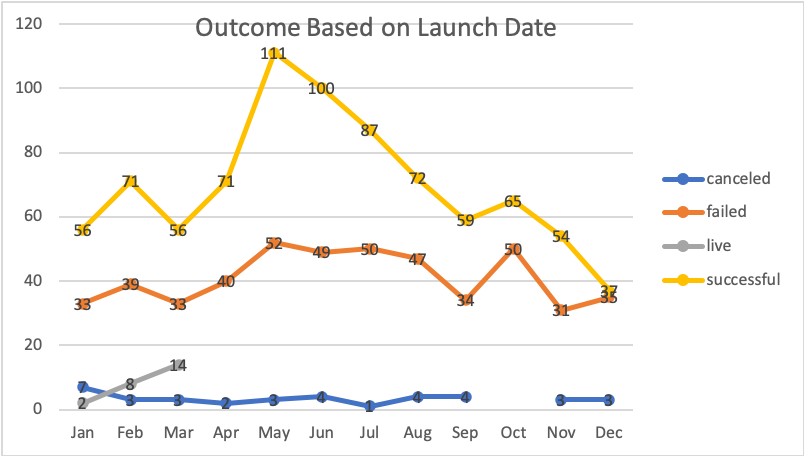
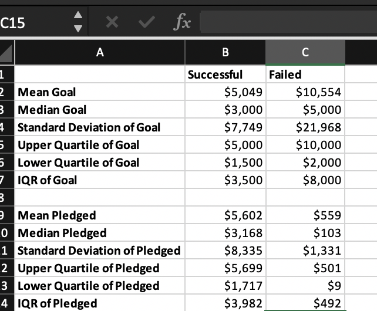

# kickstarter-analysis
#### Performing analysis on Kickstarter data to uncover trends
----------------------------------------------------------
## An Analysis of Kickstarter Campaigns Overview
#### The goal of this analysis was to find insights into the outcome of campaign strategies involving theatre based on the day they were launched and how that correlates to their success / failures
--------------------------------------------------------------------------
### Outcomes Based on Launch Date
#### In order to better view the outcomes of the theatre campaigns based on that day of launching the campaign, we creted a pivot table with the rows being "failed", "canceled", "live", and "successful" and the colums as the month that that campaign was launched. The filters on the pivot table are the Parent Category and selected "theatre" and the Year of launch. We avoided the challenge of days within the months by categorizing by month in the table. From there we attained the table below, which shows that most successful month to launch a theatre campaign was May or June, but the peak in this data is in May.  

---------------------------------------------------------------------------------------------
### Descriptive Statistics based on Goal and Pledged amounts for the US kickstarter Campaigns Successes and Fails
#### Finding the Measure of the spread of dataset. Finding the Mean and Median of Goals based on Success and Failures and comparing them to the upper quartiles of the dataset as well as the Standard Devation can give us an idea of the mean's distance from the center of the data. This was shown in the table of descriptive Statistics.

-----------------------------------------------------------------------------------
## Findings
---------------
### Findings based on Launch Date
#### From our analysis we have concluded that the best month to launch a theatre campaign is May or June
------------
### Findings based on Goals and Pledges
#### The Goal amount for a successful campaign is maxed at $5,000 and the Pledged amount is maxed $5,699
---------
### Reccomendations Based on Findings
#### The reccomendations based on the findings are to analyze outcomes of campaigns based on their ability to meet their goal of with the duration of their campaign, this provides insight into the best techniques for a successful campaign.

