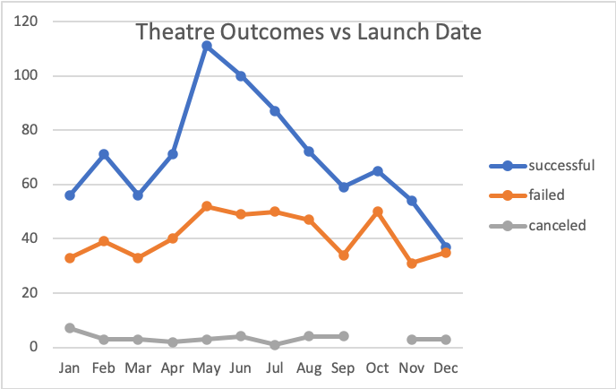

# Kickstarting with Excel

## Overview of Project

### Background

#### The Kickstarter dataset is used to understand the success and fails of campaigns. From here we are using the dataset to be able to visualize the relationships between the campaign's outcome with relation to their launch date and their fundraising goal. 

### Purpose

#### The goal of this analysis was to find insights into the outcome of campaign strategies involving theatre based on the day they were launched and how that correlates to their success / failures. We also wanted to see the correlation between the success and failure rate with reaching their Goal of  fundraised money. We created pivot charts and separate data tables in order to closer analyze the numbers correlating to the specific sections we are wanting information from. Using these we will be able to visualize the outcomes based on goals, and outcomes based on launch date to help further the analysis. 

## Analysis and Challenges

#### When analyzing the Outcomes Based on Goals we were able to avoid the challenge of ranges of amount of fundraised money by breaking up the Goals into subcategories in order to view the trend at a closer perspective. 

### Analysis of Outcomes Based on Launch Date

#### To visualize the outcomes based on launch date, a pivot table was created from the kickstarter dataset that included the parent category of the campaign type and the year of the launch as filters. We minimized the Parent Category filter to only select the theatre campaigns since this is what we were analyzing. The columns were the outcomes labeled - successful, failed, and canceled. The rows were the months the launch happened, so that we could compare the launch date to the outcome of the campaign. We see trends in the data that occur based on launch date. 

### Analysis of Outcomes Based on Goals
#### To visualize better the outcomes of campaigns based on their Goals of fundraised money we extracted data from the Kickstarter dataset and created a new spreadsheet with a range of Goal amounts as one column and then pulled the number of successful,  failed, and canceled PLAY campaigns in each range. From there we were able to take the percent of each outcome - successful, failed, and canceled in each range and created a chart including the percents against the range values. 

### Challenges and Difficulties Encountered

#### When creating the pivot table for Outcome based on Launch Date we avoided the challenge of days within the months by categorizing by month in the table. Which led to our easy analysis of the peak date within the dataset for a successful campaign based on launch date.

#### When analyzing the Outcomes Based on Goals we were able to avoid the challenge of ranges of amount of fundraised money by breaking up the Goals into subcategories in order to view the trend at a closer perspective. We narrowed down the subcategories to "plays" campaigns and from there we took the amount of successful, failed, and canceled campaigns in each range of Goals of fundraised amount for the campaigns.

## Results

#### One conclusion we were able to come to when analyzing the Outcomes based on Launch date was that the best month to launch a theatre campaign is May or June as seen in our chart, the peak outcome lies in May however, there is also a high number of successful campaigns in June. Another conclusion we were able to draw form Outcomes based on Launch Dates was that launching a campaign in December would give you the lowest success rate. 

#### A conclusion drawn from Outcomes based on Goals was that in the range of $45,00 to $49,999 we have that plays are at 100 percent success rate and 0 percent failed rate. We also concluded that in each range of goals, there is a 0 percent canceled rate. 

#### Some limitations of the Kickstarter dataset are that we aren't able to see the success rate of a campaign based on the duration of the entire campaign, which could change our results from above. 

#### In order to attend to this limitation, we could create a column of duration of campaigns and compare them to whether the length of the campaign affects the success of the campaign. Creating a table of successful campaigns based on duration of campaign could give us a better insight into what a true successful campaign entails. 

